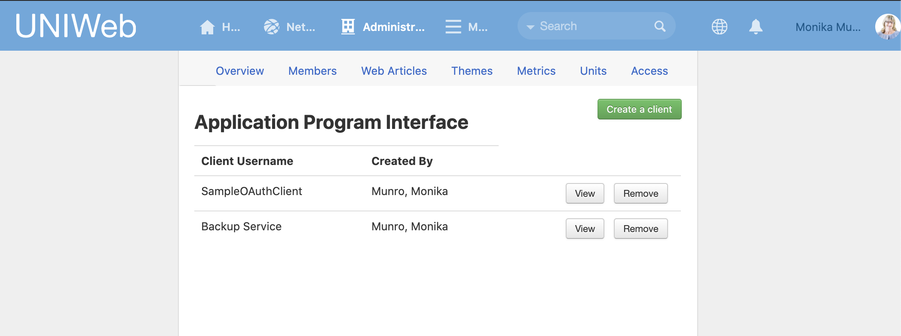
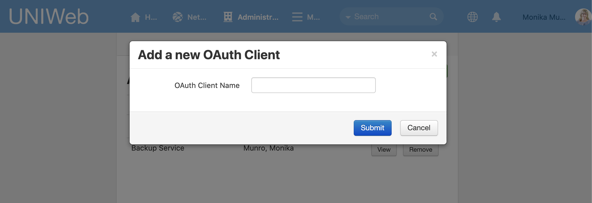
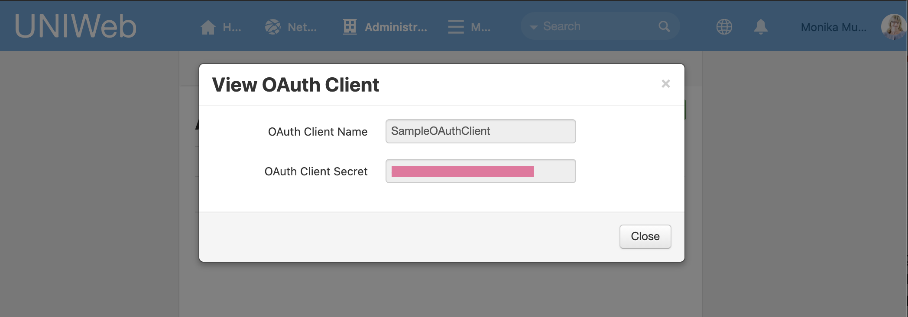
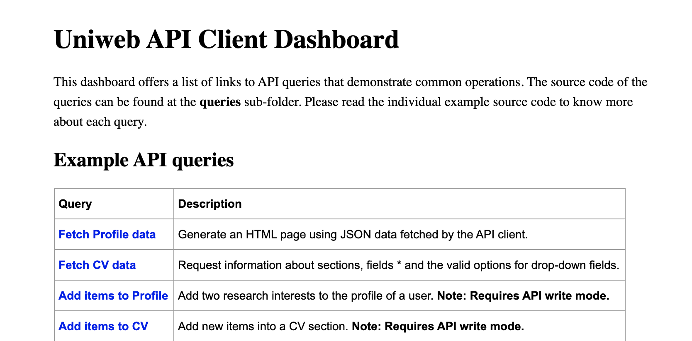

<p align="center">
  
</p>

# UNIWeb's API Definition and Client

The purpose of the API is to integrate UNIWeb with other systems within your organization. The API provides secure read/write access to information stored by UNIWeb, and it provides a mechanism to eliminate the need to duplicate data.

The UNIWeb API provides:

-   An interface that allows you to control who has access to your institution's data through our API.
-   A means by which to securely read and update your institution's information.
-   Rich data in simple, straightforward JSON for maximum readability and reusability.
-   The choice to pre-filter the requested data, to obtain just the subset of information in which you are interested.

**Learn more:** [Complete documentation of the UNIWeb API](docs/uniweb-api.md).

## API Client

An example reference client for the Uniweb API is written in PHP and can be installed via [Composer](https://getcomposer.org/).

It is common to download the client to run local tests and use the client as a reference. Other clients can be developed in different language since all the is required is the ability to send HTTP requests.

To experiment with the API client, one can simply create a project with it by running the command

```bash
composer create-project proximify/uniweb-api
```

The advantage of creating a project like that is that the `composer.json` in it already defines a CLI `query` script for [testing](#testing).

The API client can also be added as a dependency of another project via

```bash
composer require proximify/uniweb-api
```

### Testing

#### Creating the credentials

In your UNIWeb instance, go to the Administration screen and select the API section.

<p align="center">
  
</p>

Click on the "Create a client" button, enter a name for your API client, and save it.

<p align="center">
  
</p>

Once created, look for the client in the list of clients and click on its "View" button to find out the secret that was created for the client.

<p align="center">
  
</p>

> Note: the permissions of the client are those of the user that created the client.

To connect to UNIWeb via its API you will need the URL of the instance, the client name, and the client secret.

#### Using the reference UniwebClient class

The constructor of the **UniwebClient** class expects an array with credentials of the form

```php
$credentials = [
    "clientName" => "",
    "clientSecret" => "",
    "homepage" => ""
]
```

When running tests, the credentials can be defined in a json file named `credentials.json` and place within the `settings` folder. For security, `settings/credentials.json` should be added to `.gitignore` to avoid committing the secret by accident.

### Running the sample queries

The `uniweb-api` project includes a `queries` folder with code representing different use cases of the **UniwebClient** class to perform common types of API requests.

If the project was created with `composer create-project`, then the root folder will also include a `www` folder with a simple script to generate a home webpage for running the sample queries. In addition, the `composer.json` file defines a Composer command that can be used to run the queries from a terminal.

To run the sample queries you will need to set the API credentials in `settings/credentials.json`

```php
{
    "clientName": "",
    "clientSecret": "",
    "homepage": ""
}
```

The `.gitignore` file of the uniweb-api project already includes the command to exclude that file from the repository. But if you use the project as a dependency of another project, make sure that the `credentials.json` is ignored in it as well.

A simple way to test the client is to use the PHP built-in web server. To launch the built-in web server, change directory to the `www` folder within the uniweb-api project, and start the web server there.

> Note: If the project is a dependency within a parent project, you first must to go to the root folder `vendor/proximify/uniweb-api`.

```zsh
$ cd www && php -S localhost:8000
```

While the PHP web server is running, the URL `http://localhost:8000` should display the website.

<p align="center">
  
</p>

Alternatively, it is possible to test the predefined queries from the command line using composer and the `query` script.

```bash
$ composer query example3
```
