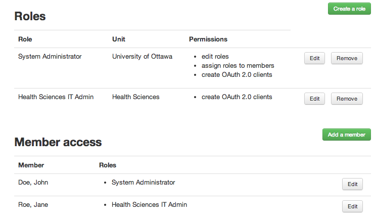
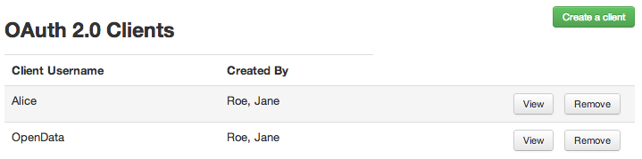
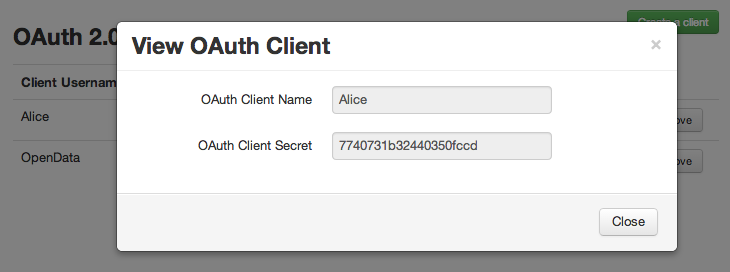
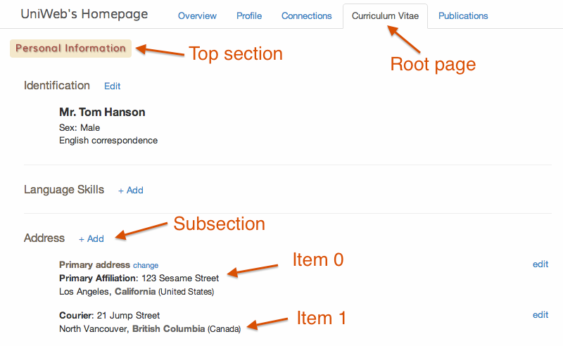
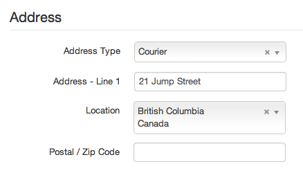

<p align="center">
  
</p>

# UNIWeb API

## Quick Note: Simple Integration

Before implementing the API, consider if you just need to embed UNIWeb content. You can use the embed parameter:

```html
<iframe
  src="https://your-uniweb-instance.com/?embed=1#!uottawa/members/1667/profile"
  width="400"
  height="300"
>
</iframe>
```

## API Overview

The purpose of the API is to integrate UNIWeb with other systems within your organization. The Authenticated API provides secure read/write access to information stored by UNIWeb, and it provides a mechanism to reduce the need to duplicate data.

The UNIWeb API provides:

- An interface that allows you to control who has access to your institution's data through our API.
- A means by which to securely read and update your institution's information.
- Rich data in simple, straightforward JSON for maximum readability and reusability.
- The choice to pre-filter the requested data, to obtain just the subset of information in which you are interested.

The UNIWeb API uses [Internet Engineering Task Force (IETF)](http://www.ietf.org/) open authentication standard [OAuth 2.0](http://oauth.net/2/), for authentication and authorization using the [Resource Owner Password Credentials Grant protocol](http://tools.ietf.org/html/rfc6749#section-4.3). In this protocol, only users with granted permission can access the API.

The following four steps are required to access a resource through API:

1.  Get permission to create OAuth 2.0 Clients
2.  Create a OAuth 2.0 client and obtain client credentials
3.  Use your Oauth 2.0 client credentials to [retrieve an access token](http://tools.ietf.org/html/rfc6749#section-4.3.2).
4.  [Use your access token](http://tools.ietf.org/html/rfc6749#section-7) to interact with the API. Your token is valid for an hour from the time it is issued.

These steps are explained in more details below.

### Setting up Authorized Clients

#### 1. Get permission to create OAuth 2.0 Clients

A **System Administrator**, can grant any user permission to create OAuth 2.0 clients. If you are not the System Administrator yourself, ask the System Administrator to give you this permission, as example below shows:

<p align="center">
  
</p>

Example above shows _Access Control_ page, accessible from _Administration_ panel, to _John Doe_, the _System Administrator_. In this example, role _Health Science IT Administrator_ has the permission to _create OAuth 2.0 clients_ for _Health Sciences_ department. _John Doe_ assigns this role to _Jane Roe_. _Jane Roe_ can now _create OAuth 2.0 clients_.

</div>

#### 2. Create a OAuth 2.0 client and obtain client credentials

Using the UNIWeb Interface, you can create, edit, view and remove OAuth 2.0 clients. Each client has a unique username referred to as _Client ID_, and a system generated random password, referred to as _Client Secret_. Example below shows _Jane Roes_'s _OAuth 2.0 Administration_ page.

<p align="center">
  
</p>

In this example, _Jane Roe_ has created two OAuth 2.0 clients. Clicking on the _view_ button for _Alice_ reveals her _Client Secret_ as shown below:

<p align="center">
  
</p>

In this hypothetical case, _Alice_'s _Client ID_ is _Alice_ and her _Client Secret_ is _7740731b32440350fccd_. These credentials are used in the next step to authenticate _Alice_.

#### 3. Authenticate and get an Access Token

With the client credentials obtained in step 3, you can authenticate to the UNIWeb _Token Endpoint_, and get an _Access Token_. An _Access Token_ is valid for one hour, and it will be used in the next step to retrieve resources from UNIWeb _Resource Endpoint_.

With these pieces of information you will be allowed to make API requests. To do so, you can use one of our pre-built client libraries

- [PHP client lib](../README.md)

#### 4. Access information through structured requests

API requests are made by submitting JSON objects to the server. They tell the server which action, resources, sections and fields are desired and what filters to apply. In particular, the request objects can have the following properties: **action**, **content**, **filter**, and **resource**.

Example request object:

```json
{
  "action": "read",
  "content": "members",
  "filter": {
    "loginName": "bob@mail.ca"
  },
  "resource": ["profile/biography", "profile/selected_degrees"]
}
```

Example response for the above request:

```json
{
  "bob@mail.ca": {
    "profile/biography": "Bob always knew he would be a great scientist",
    "profile/selected_degrees": [
      {
        "degree_name": "PhD",
        "organization": "McGill University",
        "specialty": "Materials Engineering"
      },
      {
        "degree_name": "Engineering",
        "organization": "University of Ottawa"
      }
    ]
  }
}
```

## API Requests

Before requesting information from UNIWeb, it is necessary to understand the terminology used to identify pieces of data stored in the system. The information within a UNIWeb page is usually divided into sections, sub-sections, sub-subsections and so on. A _section_ contains a list of _items_. An item within a section is made out _fields_. An API _request_ is the mechanism for obtaining the _field values_ of all items within a section.

### Resource Paths

In UNIWeb, a resource is always associated to a type of _content_. Current content types are: 'members', 'units' and 'groups'.

To request a resource, it is necessary to provide a path to it within UNIWeb. A _request path_ can be specified as a string by separating each element in the path with '/'. The path must have the following form:

    page/section/section/section/...

| Level         | Description                                                                                           |
| ------------- | ----------------------------------------------------------------------------------------------------- |
| `page`        | The 'page' where the information is displayed within UNIWeb. For example, 'profile', 'cv' or 'graph'. |
| `section/...` | Sequence of section, subsection, sub-subsection,... that contain the target set of items to retrieve. |

For example, the string

    cv/education/degrees

refers to all the items within the section _Degrees_, which is a subsection of the _Education_ section in the CV page of UNIWeb _members_.

Optionally, a request path can be specified as a JSON object. In particular, this is needed if one desires to request only a subset of the field values of an item. In this case, the _resource path_ can be given as

```json
{
  "page/section/section/section/...": ["field name A", "field name B", "..."]
}
```

It is also possible to encode the entire path as a JSON object. This is useful when requesting multiple sections under a common parent section or page:

```json
    "page":{
       "parent_section":[
         "child_section A",
         "child_section B"
       ]
    }
```

The _resource path_ above is equivalent to specifying two separate resource paths as strings:

```json
["page/parent_section/child_section A", "page/parent_section/child_section B"]
```

### Naming Conventions

The names of sections and fields used by the API are derived from the **English titles** of their respective sections and fields shown in the UNIWeb UI. Spaces, slashes and question marks are not allowed in resource names. In addition, resource names are always lowercased. To "normalize" a string to meet API rules, do the following:

1.  Lowercase the given string
2.  Replace the substrings " / ", "/", and " " with "\_"
3.  Replace the substrings "?" with the empty string ""

For example, the string "Postal / Zip Code" is normalized to "postal_zip_code".

### Section Names

The names of sections in resource paths must: (1) correspond to the sections names shown in the UNIWeb UI, and (2) be normalized according to the API naming rules described above. For example, the path to the Address resource in a CV is written as

    cv/personal_information/address

<p align="center">
  
</p>

The names of fields in resource paths must: (1) correspond to the field labels in the UNIWeb UI, and (2) be normalized according to the API naming rules described above. For example, the fields shown below in the Address section can be requested as

```json
["address_type", "address_-_line_1", "location", "postal_zip_code"]
```

<p align="center">
  
</p>

### Structuring Requests

API requests are given as JSON objects with one or more of the following properties.

<div class="indent">

<table class="Widget Table api-actions">

<tbody>

<tr>

<td>`action`</td>

<td><span class="Label Mandatory">required</span> A string value specifying the desired action to take.

<div id="action-options" class="Togglable">

<table class="Widget Table tight">

<tbody>

<tr>

<td>`add`</td>

<td>creates a new item for entry into the database</td>

</tr>

<tr>

<td>`edit`</td>

<td>edits a section field</td>

</tr>

<tr>

<td>`options`</td>

<td>returns a list of options possible to obtain additional system information</td>

</tr>

<tr>

<td>`clear`</td>

<td>clears section data</td>

</tr>

<tr>

<td>`info`</td>

<td>retrieves section info</td>

</tr>

<tr>

<td>`read`</td>

<td>returns a list of resources (e.g. members, units, etc)</td>

</tr>

</tbody>

</table>

</div>

</td>

</tr>

<tr>

<td>`content`</td>

<td><span class="Label Mandatory">required</span> Selects the type of content to retrieve.<a class="Toggler" onclick="$(this).hide().next().show().next().show();">Show options</a><a class="Toggler Togglable" onclick="$(this).hide().next().hide(); $(this).prev().show();">Hide options</a>

<div id="action-options" class="Togglable">

<table class="Widget Table tight">

<tbody>

<tr>

<td>`members`</td>

<td>refers to the departmental unit, such as 'Engineering'</td>

</tr>

<tr>

<td>`units`</td>

<td>refers to your institution listing of possible titles, such as 'Professor'</td>

</tr>

<tr>

<td>`groups`</td>

<td>may be either a UNIWeb username, login email address or UNIWeb ID. This represents the most user-specific filter option</td>

</tr>

</tbody>

</table>

</div>

</td>

</tr>

<tr>

<td>`resource`</td>

<td><span class="Label Mandatory">required</span> One or more paths to the requested resources.<a class="Toggler" onclick="$(this).hide().next().show().next().show();">Show options</a><a class="Toggler Togglable" onclick="$(this).hide().next().hide(); $(this).prev().show();">Hide options</a>

<div id="action-options" class="Togglable">

<table class="Widget Table tight">

<tbody>

<tr>

<td>

The value of this property can be a string, an object or an array of strings/objects. The format and naming conventions of resource paths are described in the section [Resource Paths](#resource_paths) above.

</td>

</tr>

</tbody>

</table>

</div>

</td>

</tr>

<tr>

<td>`filter`</td>

<td><span class="Label Optional">optional</span> An object value with filering settings.<a class="Toggler" onclick="$(this).hide().next().show().next().show();">Show options</a><a class="Toggler Togglable" onclick="$(this).hide().next().hide(); $(this).prev().show();">Hide options</a>

<div id="action-options" class="Togglable">

<table class="Widget Table tight">

<tbody>

<tr>

<td>`unit`</td>

<td>refers to the departmental unit, such as 'Engineering'</td>

</tr>

<tr>

<td>`title`</td>

<td>refers to your institution listing of possible titles, such as 'Professor'</td>

</tr>

<tr>

<td>`loginName`</td>

<td>may be either a UNIWeb username, login email address or UNIWeb ID. This represents the most user-specific filter option</td>

</tr>

<tr>

<td>`modified_since`</td>

<td>A TIMESTAMP in the range '1970-01-01 00:00:01' UTC to '2038-01-19 03:14:07' UTC. Only items modified on or after the given date are returned.</td>

</tr>

</tbody>

</table>

</div>

</td>

</tr>

<tr>

<td>`index_by`</td>

<td><span class="Label Optional">optional</span> Selects how the response indexed the resources in the answer.<a class="Toggler" onclick="$(this).hide().next().show().next().show();">Show options</a><a class="Toggler Togglable" onclick="$(this).hide().next().hide(); $(this).prev().show();">Hide options</a>

<div id="action-options" class="Togglable">

<table class="Widget Table tight">

<tbody>

<tr>

<td>`uniweb_id`</td>

<td>The internal ID of each resource is used [the default].</td>

</tr>

<tr>

<td>`login_name`</td>

<td>The login name is used [only if `content` is 'members'].</td>

</tr>

<tr>

<td>`employee_id`</td>

<td>The institutions employee ID is used [only if `content` is 'members'].</td>

</tr>

</tbody>

</table>

</div>

</td>

</tr>

<tr>

<td>`language`</td>

<td><span class="Label Optional">optional</span> Responses use the default institution's language unless specified otherwise.<a class="Toggler" onclick="$(this).hide().next().show().next().show();">Show options</a><a class="Toggler Togglable" onclick="$(this).hide().next().hide(); $(this).prev().show();">Hide options</a>

<div id="action-options" class="Togglable">

<table class="Widget Table tight">

<tbody>

<tr>

<td>`fr`</td>

<td>French is used for the response.</td>

</tr>

<tr>

<td>`en`</td>

<td>English is used for the response.</td>

</tr>

</tbody>

</table>

</div>

</td>

</tr>

</tbody>

</table>

</div>

</section>

<section id="examples">

## Example Requests

#### Simple Single Resource Read Request

The request that follows would return the public profile information of all people in the Department of Civil Engineering as JSON.

```json
{
  "action": "read",
  "content": "members",
  "filter": {
    "unit": "Civil Engineering"
  },
  "resources": "profile"
}
```

#### Requesting to Read Multiple Resources in a Single Request

The request that follows would return two resources belonging to the user with login name `john@smith.ca`, which include:

1.  the publicly available research interest tags found on his Profile
2.  the Degree Name, Specialization, and Thesis Title fields from his CV found under Education > Degrees

```json
{
  "action": "read",
  "content": "members",
  "language": "fr",
  "filter": {
    "unit": "McGill",
    "title": "Professor",
    "login": "john@smith.ca"
  },
  "resources": [
    "profile/research_interests",
    {
      "cv/education/degrees": ["degree_name", "specialization", "thesis_title"]
    }
  ]
}
```

<section id="errors">

## Error Messages

Errors will give information about what went wrong with a corresponding request. They will be of the following form:

```json
{
  "error": {
    "message": "Error validating access token.",
    "type": "OAuthException",
    "code": 98,
    "error_subcode": 223
  }
}
```
